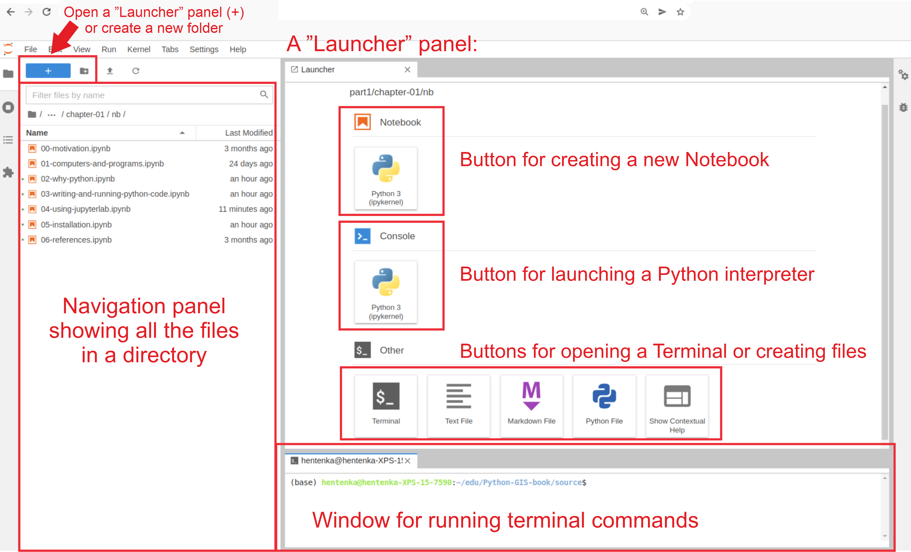

Approximate time: 30 minutes

## Learning Objectives 

In this lesson, we will:

- Describe what Python and Jupter Lab are
- Familiarize ourselves with the Jupyter Lab interface
- Interact with Python within Jupyter Lab

## Overview of lesson

When doing XYZ...

## What is Python?

[Python](https://www.python.org/) is a programming language that allows us to write code to perform various tasks. It interprets code, written in a particular syntax, to execute tasks defined by the programmer. Due to its simplicity and readability, Python is a great language for beginners, but is also powerful enough to be used to answer complex, real world questions. Therefor many fields, such as data science, machine learning, bioinformatics, and more have adopted Python a tool for their work.

::: columns
::: column
::: {#fig-python_logo .figure}
{width=90px}

Python logo.
:::
:::
::: column
**The Python environment combines:**

- Effective handling of big data
- Collection of integrated tools
- Graphical facilities
- Simple and effective programming language
:::
:::

### Why use Python?

Python has a large ecosystem of libraries that can be used for a wide range of applications, from data wrangling to bioinformatics analyses.

Among its many capabilities, Python is particularly well-suited due to:

- Ease of data handling, wrangling, and storage
- Capability to run statistical analyses with many graphical techniques
- How it can be installed on any computer and (and it’s free!)
- Its open source community

In addition, Python has a large and active community, which means there are many resources available for learning and troubleshooting. 

## Anaconda

[Anaconda](https://www.anaconda.com/) is a popular distribution of Python. When you install Anaconda, you get a Python environment as well as many useful libraries and tools for data science and scientific computing. It provides an easy way to manage Python environments and packages.

::: callout-note
# Installing Anaconda
Prior to today's lesson, you should have installed [Anaconda](https://www.anaconda.com/download) onto your computer. 
:::

By installing Anaconda, we have also installed Python. 

### Anaconda Navigator

We can get started by opening the application Anaconda Navigator, which was installed with the link above. This program allow us to interface with Python environment and applications.

When opening the application, the screen should look something like this:

::: {#fig-anaconda_nav .figure}


Anaconda Navigator interface.
:::

### Navigator Sections

There are four main sections of the Anaconda Navigator interface:

1. **Home**: This is the default view when you open Anaconda Navigator. It provides access to applications, like Jupyter Lab, PyCharm, Spyder, and more.
2. **Environments**: This section allows you to manage different Python environments. You can install packages and create new environments here.
3. **Learning**: Here, you can access to various resources for learning Python and data science, including tutorials, and documentation.
4. **Community**: This section links to forums, blogs, and other resources for connecting with other Python users.

::: callout-note
# Environments
The environments section of Anaconda Navigator allows you to manage multiple Python environments. This is useful for keeping your projects organized and avoiding conflicts between packages. For example, if you are working on two different projects that require different versions of a package, you can create separate environments for each project to avoid conflicts.

We will discuss environments in more detail later in this workshop. For now, we will be working in the base, default, environment.
:::


## Jupyter Lab

::: columns
::: column
One of the packages downloaded with Anaconda is [Jupyter Lab](https://jupyter.org/). These are interactive environments that allow you to create and share your Python code and visualizations. Jupyter Lab are widely used for sharing results and running analyses.

Rather than creating scripts that are run in a terminal, Jupyter Lab allow you to write and execute code in a more interactive way. You can write code in cells, run those cells, and immediately see the output. This makes it easier to experiment and test your code as you go.

:::
::: column
::: {#fig-jupyter_lab_logo .figure}
{width=150px}

Jupyter Lab logo.
:::
:::
:::

Let us open Jupyter Lab by clicking the "Launch" button under the Jupyter Lab application in Anaconda Navigator. This will open a new tab in your web browser with the Jupyter Lab interface.

::: callout-warning
TODO: Make our own screenshot, I have just taken this from the this other workshop for now since I have many conda environments when I open mine. It woul dbe nice to have a similarly labeled image.
:::

::: {#fig-jupyter_lab_interface .figure}


Jupyter Lab interface.<br>
_Source: [Python for Geographic Data Analysis](https://pythongis.org/part1/chapter-01/nb/04-using-jupyterlab.html)_
:::

Even though Jupyter Lab opens your web browser, it is not actually accessing the internet. It is running on your local computer at the port `http://localhost:8888` which is hosted on your computer and is not accessible to anyone else.

### File Navigator

On the left-hand side of Jupyter Lab, we have access to the file navigator. This allows us to navigate through the files on our computer and open them in Jupyter Lab. To begin, let us make a new folder for this workshop in our `Desktop` folder. To create a new folder titled, "intro_python", click the "New Folder" button in the file navigator. 

:::{.callout-tip}
# [**Exercise 1**](01_setting_up-Answer_key.qmd#exercise-1)

To organize your working directory for a particular analysis, you should separate the original data (raw data) from intermediate datasets. For instance, you may want to create:

- `data/`: directory within your working directory that stores the raw data
- `scripts/`: directory for your Python scripts and notebooks
- `results/`: folder for intermediate results
- `figures/`: directory for the plots you will generate.

For this exercise create each of these directories. When finished, your working directory should look like this:

::: {#fig-jupyter_file_nav .figure}
{width=300px}

File navigator in Jupyter Lab after creating directories.
:::

:::

### Menu Bar

The menu bar at the top of Jupyter Lab provides access to various functions and features. Some of the main options include:

::: callout-warning
TODO: Copy pasted from CCB: https://ccb-hms.github.io/workbench-python-workshop/01-introduction.html
:::

| Menu     | Description                                                                                                                                                                                                 |
|----------|-------------------------------------------------------------------------------------------------------------------------------------------------------------------------------------------------------------|
| File     | Actions related to files and directories such as New, Open, Close, Save, etc. The File menu also includes the Shut Down action used to shut down the JupyterLab server.                                   |
| Edit     | Actions related to editing documents and other activities such as Undo, Cut, Copy, Paste, etc.                                                                                                             |
| View     | Actions that alter the appearance of JupyterLab.                                                                                                                                                           |
| Run      | Actions for running code in different activities such as notebooks and code consoles (discussed below).                                                                                                   |
| Kernel   | Actions for managing kernels. Kernels in Jupyter will be explained in more detail below.                                                                                                                   |
| Tabs     | A list of the open documents and activities in the main work area.                                                                                                                                         |
| Settings | Common JupyterLab settings can be configured using this menu. There is also an Advanced Settings Editor option in the dropdown menu that provides more fine-grained control of JupyterLab settings and configuration options. |
| Help     | A list of JupyterLab and kernel help links.                                                                                                                                                                |

## Creating a Python Notebook

From the menu bar, create a new notebook with `File -> New -> Notebook`. This will open a notebook in a new tab. 

You may be prompted to select a kernel. A kernel refers to the environment used to execute code in the notebook. This is in reference to the environments that can be managed in Anaconda Navigator. We will discuss environments in more detail later in the workshop, but for now we will be working with base as we become familiar with Python and Jupyter Lab. So select the `Python [conda env: base]` kernel from the dropdown menu.

A Jupyter Notebook is a document that contains both code and text inside cells. Cells are the building blocks of a Jupyter Notebook. They can contain code, text, or other types of content.

::: {#fig-jupyter_notebook .figure}


Freshly created Jupyter Notebook.
:::

We can see in the File Navigator that we have a new file called `Untitled.ipynb`. The `.ipynb` extension stands for "interactive Python notebook". We can rename this file by right-clicking on it in the File Navigator and selecting "Rename". Let us rename this file to `intro_python.ipynb`.

## Running Python Code

In the notebook, we can write Python code in the cells. To create a new cell, click the `"+"` button in the toolbar at the top of the notebook.

**Now that we are all set up, let us try running some Python code in our notebook!**

Let us start by evaluating what the sum of 3 and 5 is. We are also going to include comments in our code to describe what we are doing. This is best practice for writing code, as it allows others (and your future self) to understand what the code is doing. To write a comment in Python, we use the `#` symbol. Anything that follows the `#` symbol on a line is considered a comment and is not executed as code.

```{python}
#| label: code_example
# Intro to Python Lesson
# March 2026
# Author: Harvard Chan Bioinformatics Core


# Add 3 and 5
3 + 5
```

To run a cell, you can click on the cell and then click the "Run" button in the toolbar at the top of the notebook. You can also use the keyboard shortcut `Shift + Enter` to run a cell.

::: {#fig-jupyter_code_output .figure}


Output of running 3 + 5 in Jupyter Lab.
:::

What happens if we do that same command without the comment symbol `#`? Re-run the command after removing the `#` sign in the front:

```{python}
#| label: rm_comment_error
#| error: true
Add 3 and 5
3 + 5
```

Now Python is trying to run that sentence as a command, and it doesn’t work. We get an error in the console. This means that the Python interpreter did not know what to do with that command. Reintroduce the `#` to re-comment the appropriate line.

This is a clear example of how Python has a specific syntax that must be followed for the code to run properly. We will continue to learn more about the proper format of Python code as we go through the workshop. It really is its own _language_ just like English, but with its own grammar and rules.

## The Importance of Comments

Before we move on to more complex concepts and getting familiar with the language, we emphasize the importance of commenting your code.

Use `#` signs to comment. Comment liberally in your Python scripts. This will help future you and other collaborators what your code was meant to do. Anything to the right of a` #` is ignored by Python. A shortcut to comment out entire chunks of code is to highlight several lines and hit `Ctrl+/` (or `Cmd+/` on a Mac).


***

[Next Lesson >>](02_variables.qmd)

[Back to Schedule](../schedule/schedule.qmd)