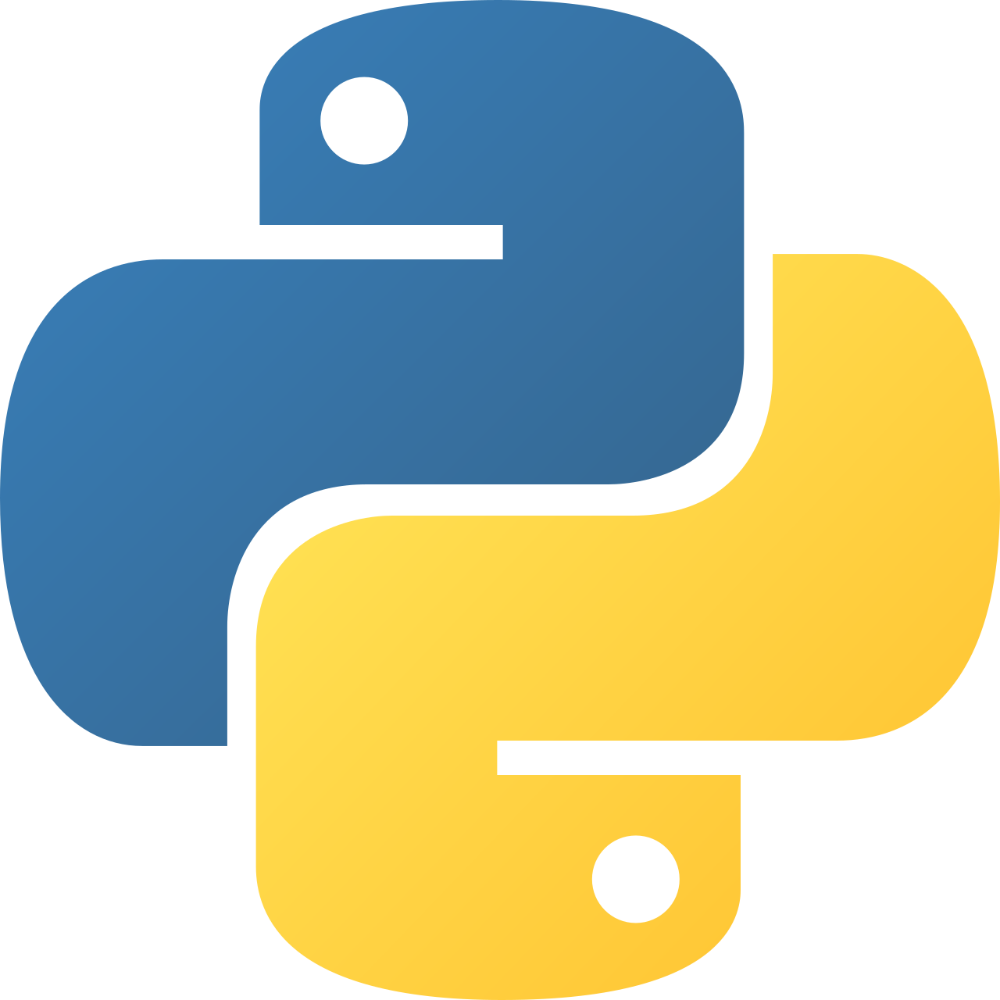
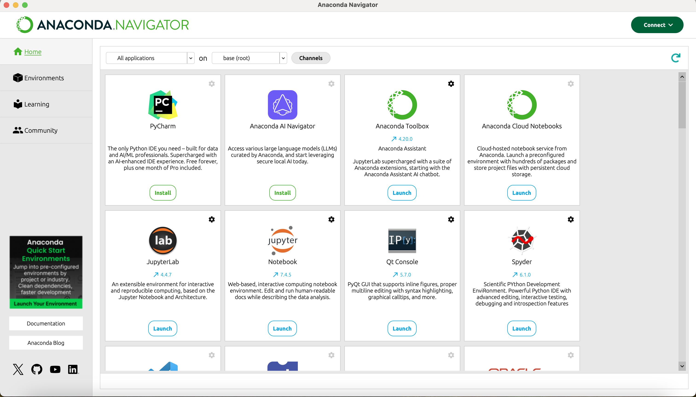
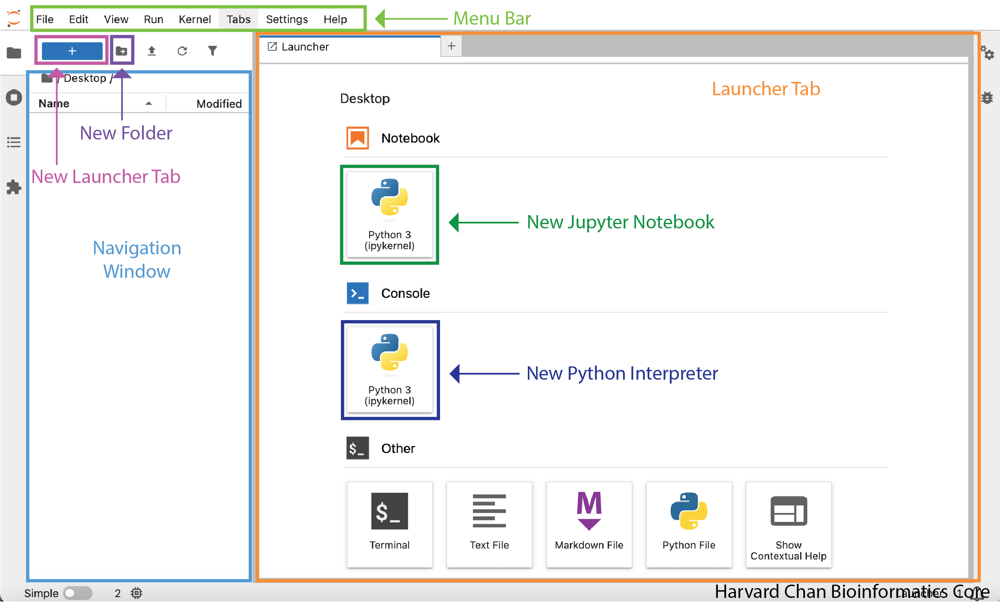
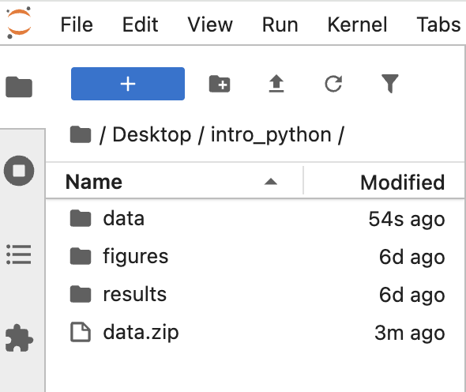
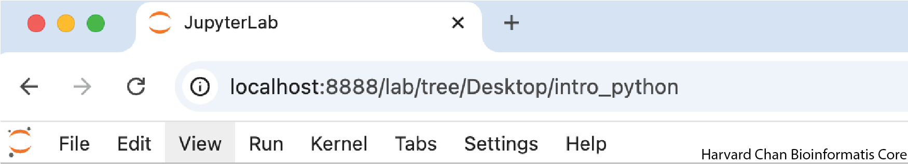
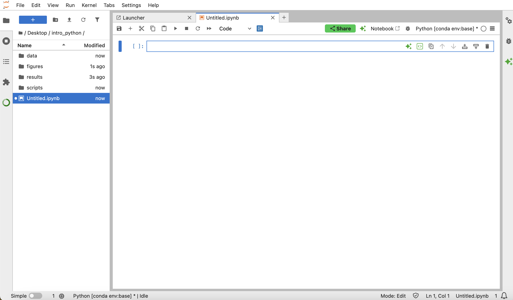
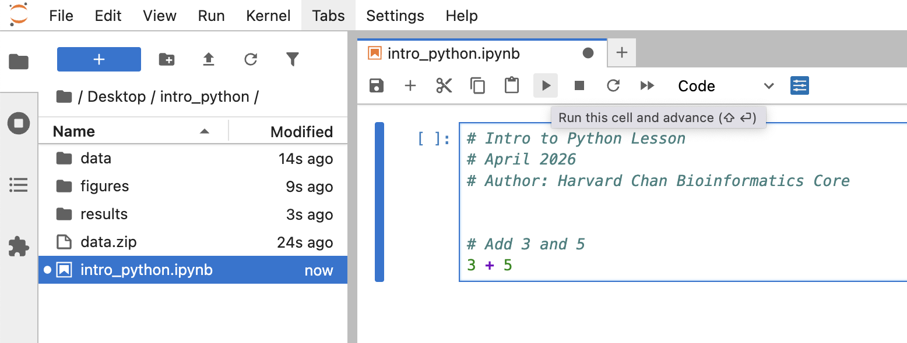

Approximate time: 30 minutes

## Learning objectives 

In this lesson, we will:

- Describe what Python and JupyterLab are and do
- Familiarize ourselves with the JupyterLab interface
- Interact with Python within JupyterLab

## Overview of lesson

This lesson includes instructions on how to install Python, open a JupyterLab notebook and **run Python code on your own**. We will be using `Anaconda` and JupyterLab so that you can work within the notebook ecosystem, which allows you to see the results of your code immediately. These same tools are widely used across fields for research and data scientists to explore datasets, document code and share results with collaborators.

By the end, you will have a working Python environment that you can reuse for future projects, whether you are automating a task or starting a larger analysis!

## What is Python?

[Python](https://www.python.org/) is a programming language that allows the user to write code to execute tasks. Python is a great language for beginners due to its simplicity and readability! It is also powerful enough to be used by experts to answer complex, real world questions. Therefore many fields, such as data science, machine learning, artificial intelligence, bioinformatics and many more have adopted Python as a tool for their work.

::: columns
::: column
::: {#fig-python_logo .figure}
{width=90px}

Python logo.
:::
:::
::: column
**The Python environment allows:**

- Efficient handling of large datasets
- Extensive libraries for a multitude of tasks
- Graphical interface
- Simplistic syntax and memory management
- Visualization methods
:::
:::

### Why use Python?

Python has a large ecosystem of libraries that can be used for a wide range of applications, from cleaning dataframes (data wrangling) to building machine learning models.

Among its many capabilities, Python is particularly well-suited for:

- Data handling, wrangling and storage
- Statistical analyses with many graphical techniques
- Accessibility as it can be installed on any computer and it’s **free!**

In addition, Python has a large and active community, which means there are many resources available for learning and troubleshooting. 

## Anaconda

[Anaconda](https://www.anaconda.com/) is a popular distribution of Python. When you install Anaconda, you get a Python environment as well as many useful libraries and tools for data science and scientific computing. It also provides an easy way to manage Python environments and packages.

::: callout-note
# Installing Anaconda
You should already have installed [Anaconda](https://www.anaconda.com/download) onto your computer prior to today's lesson. You should now have an application called "Anaconda Navigator". 
:::

Python is installed along with Anaconda, so you do not need to install Python separately.

### Anaconda Navigator

We can get started by opening the application Anaconda Navigator. This program allows us to interface with Python environments and programs.

When opening the application, the screen should look something like this:

::: {#fig-anaconda_nav .figure}


Anaconda Navigator interface.
:::

### Navigator sections

There are four main sections of the Anaconda Navigator interface:

1. **Home**: This is the default view when you open Anaconda Navigator. It provides access to applications and tools, like JupyterLab, PyCharm, Spyder and more.
2. **Environments**: This section allows you to manage different Python environments. You can install packages and create new environments.
3. **Learning**: Here, you can access to various resources for learning Python and data science, including tutorials and documentation.
4. **Community**: This section links to forums, blogs and other resources for connecting with other Python users.

::: callout-note
# Environments
The environments section of Anaconda Navigator allows you to manage multiple Python environments. This is useful for keeping your projects organized and avoiding version and dependency issues. For example, if you are working on two different projects that require different versions of a package, you can create separate environments for each project to avoid conflicts.

We will discuss environments in more detail later in this workshop. For now, we will be working in the base, default, environment.
:::


## JupyterLab

::: columns
::: column
One of the applications downloaded with Anaconda is [JupyterLab](https://jupyter.org/). JupyterLab allows users to create interactive environments (notebooks) that allow you to create and share your Python code and visualizations. JupyterLab is widely used for sharing results and running analyses since you can see intermediate results from code chunks through the notebook.

JupyterLab allows you to write and execute code in a more interactive way than just running scripts in a terminal. You can write code in **cells**, run those cells and immediately see the output. This makes it easier to experiment and test your code as you go.

:::
::: column
::: {#fig-jupyter_lab_logo .figure}
{width=150px}

JupyterLab logo.
:::
:::
:::

We will open JupyterLab by clicking the "Launch" button under the JupyterLab application in Anaconda Navigator. _This will open a new tab in your web browser with the JupyterLab interface._

::: {#fig-jupyter_lab_interface .figure}


JupyterLab interface.<br>
_Source: [Python for Geographic Data Analysis](https://pythongis.org/part1/chapter-01/nb/04-using-jupyterlab.html)_
:::

Even though JupyterLab opens your web browser, it is not actually accessing the internet. It is running on your local computer at the port `http://localhost:8888`, which is only hosted on your computer and is not accessible to anyone else.

### File navigator

The navigation panel on the left-hand side allows us to access the file navigator, which allows us to navigate through the files on our computer and open them in JupyterLab. To begin, let us make a new folder for this workshop in our `Desktop` folder. To create a new folder, first navigate to your Desktop in the naviation panel, then click the "New Folder" button above the file navigator and title it `intro_python`. 

::: {#fig-Create_intro_python .figure}
{width=600px}

Creating `intro_python` directory.
:::

:::{.callout-tip}
# [**Exercise 1**](01_setting_up-Answer_key.qmd#exercise-1)

1. When organizing your working directory for a particular analysis, you should separate the original data (raw data) from the intermediate datasets. For instance, you may want to create:

- `data/`: directory within your working directory that stores the raw data
- `results/`: directory for intermediate results
- `figures/`: directory for the plots you will generate

We will create all of the above directories for this exercise. You can download the `data` directory by right-clicking [here](https://www.dropbox.com/scl/fi/es4001gzlhsc2ucu2mb7o/data.zip?rlkey=9ql2nmshcz3ghm558qnloh441&st=77nbzkt0&dl=1) and selecting "Save Link As...". Place the ZIP file within your `intro_python` directory. Within a file browser, navigate to your `intro_python` directory and double-click on the `data.zip` file in order to uncompress it. 

Next, go ahead and add a `results` and `figures` directory within your `intro_python` directory. When finished, your working directory should look like this:

::: {#fig-jupyter_file_nav .figure}
{width=300px}

File navigator in JupyterLab after creating directories for data management.
:::

:::

### Menu bar

The menu bar at the top of JupyterLab provides access to various functions and features. Some of the main options include:

::: {#fig-menu_bar .figure}
{width=500px}

Menu bar in JupyterLab.
:::

Table: JupyterLab menu options and descriptions. {#tbl-jupyter_menu}

| Menu | Description |
|----|--------|
| **File** | Provides options for opening, closing, saving and exporting files. |
| **Edit** | Provides options for undo, redo and control over cells.  |
| **View** | Provides options for controlling the appearance of JupyterLab. |
| **Run** | Provides actions for running cells of code. |
| **Kernel** | Provides options for handling the kernel. |
| **Tabs** | Provides options for the tabs open in the workspace. |
| **Settings** | Provides options for JupyterLab settings. |
| **Help** | Provides links to reference materials for using JupyterLab |

## Creating an interactive Python notebook (ipynb)

Create a new notebook from the menu bar with `File -> New -> Notebook`. This will open a notebook in a new tab. 

You may be prompted to select a kernel for the new notebook. A kernel refers to the environment used to execute code in the notebook. These environments can be managed in Anaconda Navigator. We will discuss environments in more detail later in the workshop, but for now we will be working with the base environment as we become familiar with Python and JupyterLab. For now, we will just select the `Python [conda env: base]` kernel from the dropdown menu.

::: {#fig-jupyter_notebook .figure}


Freshly created Jupyter Notebook.
:::

We can see in the File Navigator that we have a new file called `Untitled.ipynb`. The `.ipynb` extension stands for "interactive Python notebook". We can rename this file by right-clicking on it in the File Navigator and selecting "Rename". Let us rename this file to `intro_python.ipynb`.

::: {#fig-Create_intro_python .figure}
{width=600px}

Creating Jupyter notebook and renaming it.
:::

## Running Python code

We will be writing text within the cells of the Jupyter Notebook. These blocks can either be text (Markdown) or code (Python). To create a new cell, click the `"+"` button in the toolbar at the top of the notebook. **Each time we come across a code block in these lessons, we will click the "+" button to create a new code block in our Jupyter Notebook.** We could add all of the code to a single code block, but then we would need to re-evaluate all of the code each time we added some code. If we make new code block for each chunk of code, we only need to run the new code and not the previous code.

::: callout-note
# Using Markdown within Jupyter Notebook
Jupyter notebooks are capable of being rendered into HTML documents. Because of this, you can add text around your code blocks using Markdown. If you are interested in learning more about using Markdown to do this, this [Markdown basics from the Jupyter Documentation](https://jupyter-notebook.readthedocs.io/en/stable/examples/Notebook/Working%20With%20Markdown%20Cells.html) is helpful.
:::

**Now that we are all set up, let's run our first line of Python code!!!**

We will start by calculating the sum of 3 and 5. We are also going to include **comments** in our code to describe what we are doing. This is best practice for writing code, as it allows others (and your future self) to understand the code and its purpose. In order to write a comment in Python, we first add the `#` symbol. Anything that follows the `#` symbol on a line is considered a comment and is not executed as code.

```{python}
#| label: code_example
# Intro to Python Lesson
# April 2026
# Author: Harvard Chan Bioinformatics Core


# Add 3 and 5
3 + 5
```

You can run a cell by clicking on the cell and then clicking the "Run" button in the toolbar at the top of the notebook. You can also run cells with the keyboard shortcut `Shift + Enter`.

::: {#fig-jupyter_code_output .figure}


Output of running 3 + 5 in JupyterLab.
:::

What happens if we run that same command without the comment symbol `#`? Re-run the command after removing the `#` sign in the front:

```{python}
#| label: rm_comment_error
#| error: true
Add 3 and 5
3 + 5
```

Python is trying to run the text "Add 3 and 5" as a command, which is not valid Python syntax. As a result, we get an `invalid syntax` error in the console. This error means that the Python interpreter did not know what to do with that command. Re-add the `#` to re-comment the appropriate line.

This is a clear example of how Python requires a specific syntax that must be followed for the code to run properly. We will continue to learn more about the syntax and structure of Python code as we go through the workshop. It really is its own _language_, just like English, with its own grammar and rules.

## The importance of comments

Before we move on to more complex concepts and getting familiar with the language, we want to re-emphasize the importance of commenting your code.

Use `#` signs to comment. **Comment liberally** in your Python scripts. This will help future you and other collaborators understand what your code is doing. Anything to the right of a` #` is ignored by Python. A shortcut to comment out entire chunks of code is to highlight several lines and hit <kbd>Ctrl</kbd> + <kbd>/</kbd> (or <kbd>Cmd</kbd> + <kbd>/</kbd> on a Mac).


***

[Next Lesson >>](02_variables.qmd)

[Back to Schedule](../schedule/schedule.qmd)
