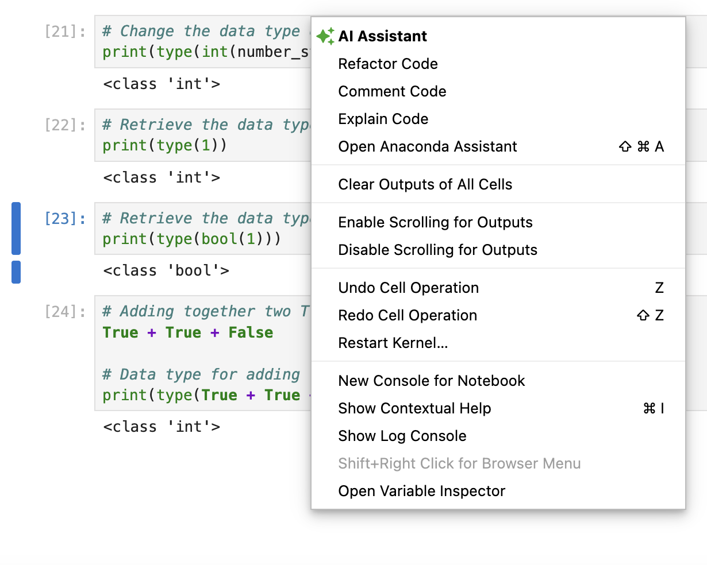
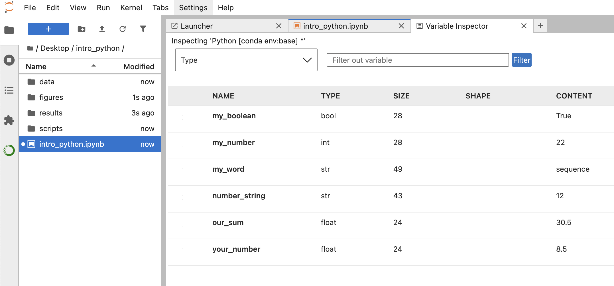

Approximate time: 35 minutes

## Learning objectives 

In this lesson, we will:

- Assign values to variables
- Describe the different data types available

## Overview of lesson

Variables are one of the most fundamental units in many programming languages. Variables can be thought of as a label for an object. You can then retrieve this object for later use. Some helpful uses for variables are:

- The output of something processed needs to be stored for later use
- A value is used multiple times in an analysis
- Your code is being read by others

You will often create variables in many different programming languages for all three of the above reasons. Let's go ahead and dive into how to create variables within Python.

## Assigning variables

In Python, in order to assign a value to an object we need to use `=`. For example, you might have a number or word that you'd like to store to use at a later time like this: 

```{python}
#| label: create_variable
# Creating a variable 
my_number = 16
```

:::{.callout-note}
# Python rules and guidelines for variable names
When creating variables in Python, there are some rules and guidelines that you should follow:

***Rules***

- Python variables are ***case sensitive***, so `my_number` and `My_number` are different variables
- Variables names must only consist of letters, numbers and underscores
- Must begin with a letter or an underscore, it cannot start with a number. Starting a variable with an underscore has some special properties that are beyond the scope of this workshop
- It cannot be a reserved keyword such as `for` or `if`

***Guidelines***

- Make variable names meaningful. Technically, there is nothing wrong with a variable named `s5ro_l67`, but that is likely not very descriptive to yourself and others
- Use camel case (`MyVariableName`) or underscores (`my_variable_name`) to denote multi-word variable names 
- Be consistent in your style

There is an [official Python style guide](https://peps.python.org/pep-0008/) that has much more detailed guidelines.
:::

If we would like to see the value of a variable we have created, we can use the the `print()` function:

```{python}
#| label: show_my_number
# Show my_number
my_number
```

### Printing variables

Another way you can print a variable is by putting it within a `print()` function:

```{python}
#| label: print_my_number
# Print my_number
print(my_number)
```

Putting variables within `print()` function can be very helpful in case you want to inspect multiple variables. We will see this shortly. You can also add text around a variable within the `print()` function:

```{python}
#| label: text_within_print
# Added text within the print function
print('I want to remember', my_number, 'for later use.')
```

::: {.callout-note}
# The `print()` function
You can see that when we add text around a variable, it automatically adds spaces on either side of that variable inside the `print()` function.
:::

Let's go ahead and create a second number that we are interested in:

```{python}
#| label: create_variable_2
# Creating a second variable called your_number
your_number = 8.5
```

We can use the `print()` function to see the values of these variables:

```{python}
#| label: multiple_variable_within_print
# Multiple variable within a print function
print('I want to remember', my_number, 'and', your_number)
```

This is a great place to highlight why it can be advantageous to use the `print()` function over just calling variables without it. If we wanted to inspect `my_number` and `your_number`, we might be inclined to try it without the print function:

```{python}
#| label: without_print
# Show my_number
my_number

# Show your_number
your_number
```

Do you notice that it only has the output from `your_number`? This is because without the `print()` function. It will return variables as they are processed, but they will be overwritten, so only the final variable remains. However, if we use the `print()` function, we will retain both variables:

```{python}
#| label: with_print
# Print my number
print(my_number)

# Print your_number
print(your_number)
```

::: callout-note
# f-strings
f-strings (formatted string literals) are a concise way to build strings that include variable values or expressions. They’re prefixed with f  let you put Python expressions directly inside `{}` within the string and can support functions and methods. We can see an example below:

```{python}
#| label: f_string_example
# f-string Example
print(f'I want to remember {my_number} and {your_number}')
```
:::

You can carry out basic arithmetic using variables. For example, if we wanted to add `my_number` and `your_number`, we could do that with:

```{python}
#| label: add_variables
# Add our numbers
print(my_number + your_number)
```

Additionally, we can assign the output of that summation to a new variable:

```{python}
#| label: add_variables_assign
# Add our numbers
our_sum = my_number + your_number

# Print the sum of our numbers
print(our_sum)
```

:::{.callout-note}
# White space
Python uses white-space to define scope, but when assigning values to a variable, Python has no set rules how to do this. The assignments below are all treated the same within Python:

```{python}
#| label: white_space_example_1
# No whitespace on either side of =
x=3

# Print the value of x
print(x)
```

```{python}
#| label: white_space_example_2
# One space on either side of =
x = 3

# Print the value of x
print(x)
```

```{python}
#| label: white_space_example_3
# Three spaces on either side of =
x    =    3

# Print the value of x
print(x)
```
:::

### Re-assigning variable

You can also assign a new value to a variable. Let's update `my_number` to be a new number:

```{python}
#| label: number reassignment
# Print my_number
print(my_number)

# Update the value of my_number
my_number = 22

# Print my_number after it was updated
print(my_number)
```

```{python}
#| label: dependent_reassignment
# Print the sum of our numbers
print(our_sum)

# Add our numbers
our_sum = my_number + your_number

# Print the sum of our numbers
print(our_sum)
```

Notice that the variable `our_sum` does not change even though we updated `my_number` until we use the `=` to assign it a new value. 

:::{.callout-tip}
# [**Exercise 1**](02_variables-Answer_key.qmd#exercise-1)
1. Create two new variables called `a`, that has the value of 5, and `b`, that has the value of 3.
2. Subtract `b` from `a` and assign it to the new variable called `difference` 
3. Using the variables `a`, `b` and `difference`, print out the sentence that looks like:

```{python}
#| label: exercise_1_hidden
#| echo: false
# Create variables
a = 5
b = 3

# Subtract variables and assign them to difference
difference = a - b
```

```{python}
#| label: exercise_1_sentence
#| echo: false
print('The difference of', a, 'and', b, 'is', difference)
```
:::

## Types of variables

Now that we have a basic understanding of what a variable is, let's discuss the different **data types** that hold a single value. Some of the most common data types are:

Table: Common Python data types. {#tbl-common_data_types}

| Type | Description | Example |
|-----|-----|-----|
| int | Integers (whole numbers) | 7, -3, 42 |
| float | Floating point numbers (numbers with decimals) | 3.14, 0.5 |
| bool | Booleans (True/False values) | True, False |
| str | Strings or characters (text) | "hello", "3" |

We can determine data type of a variable is by using the `type()` function.

```{python}
#| label: type_function
# Data type of my_number
print(type(my_number))
```

:::{.callout-note}
# Nested functions
When we have functions nested inside of one another, the innermost function is evaluated first and the output from it is passed to the next outer function until you reach the outermost function. In the example above, `my_number` is evaluated by the `type()` function and the output of the `type()` function is then passed onto the `print()` function.
:::

### Integers and floats

Integers are whole numbers and floats are numbers with decimals. Both of these data types can be used in mathematical operations together. For example, we can add together an integer and a float:

```{python}
#| label: integer_float_addition
# Add integer and float together
5 + 3.14
```

::: {.callout-note collapse="true"}
# You do not always have to `print()` your variables
You can directly see the output for a variable to if you run a cell and the variable is the last line in the code chunk. However, this will ony work for seeing on variable at a time, so if you wanted to see two variables as the same time, we would have to use the print function. For example:

```{python}
#| label: print_example_1
our_sum
my_number
```

versus

```{python}
#| label: print_example_2
print(our_sum)
print(my_number)
```

:::


### Strings

Strings are a data type that can hold a sequence of characters. Strings are denoted by wrapping the string in either single- or double-quotes and either is acceptable. 

```{python}
#| label: string_variable
# Create a string variable
my_word = 'sequence'

print(type(my_word))
```

:::{.callout-note}
# Single- and double-quotes
In order to demonstrate that Python is indifferent between single- and double-quotes, we can also create a string variable with double-quotes and we can see that Python still returns that this variable is of the string data type:

```{python}
#| label: string_variable_double_quotes
# Create a second string variable
my_other_word = "chromosome"

# Print the data type for a double-quoted string
print(type(my_other_word))
```
:::

If you were to place a variable name within quotes, it will be evaluated as a string rather than as a variable. For example:

```{python}
#| label: quote_variable
# Printing a variable name within quotes
print('my_number is a string, but', my_number, 'is a variable.')
```

Furthermore, if you were to place a numeric value within quotes, then Python will interpret that number as a string rather than as a number.

```{python}
#| label: number_in_quotes
# Number in quotes is a string
number_string = '12'

# Print the data type of number_string
print(type(number_string))
```

And if you were to attempt to add together a string and a numeric value, integer or floating point, Python will return an error message letting you know that adding together numbers and strings is not permitted. This is even true if the string only consists of numbers like `number_string`:

```{python}
#| label: adding_strings_numbers
#| error: true
# Trying to add strings and numbers
my_number + number_string
```

### Booleans

Booleans are another data type that denotes `True` and `False` values. Booleans are often used in conditional statements, which we will cover in the next lesson, but they can also be useful for other purposes. This will allow you to selectively run lines of code, only if a condition is evaluated to be `True`.

```{python}
#| label: create_boolean
# Create a boolean variable
my_boolean = True

print(type(my_boolean))
```

Note that the words `True` and `False` are reserved keywords in Python, so they cannot be used as variable names. Additionally, they are capitalized in Python, so if you were to write `true` or `false`, Python would not recognize those as booleans and would return an error message:

```{python}
#| label: boolean_error
#| error: true
# Trying to use true and false as variable names
my_boolean = true
```

### Changing the Data Type

Let's consider the case where you have perhaps classified the data type of variable incorrectly. In our case, `number_string` is a string with the number `12`. We can see that:

```{python}
#| label: number_string_data_type_1
# Data type of number_string
print(type(number_string))
```

But we can tell Python to interpret this string as a number if we would like to, by using either the `int()` or `float()` functions.

```{python}
#| label: number_string_data_type_2
# Change the data type of number_string to integer
print(type(int(number_string)))
```

Sometimes, `0` and `1` denote `False` and `True`, respectively, in the world of computers, but if we evaluate the type for `0` or `1`, we will know that by themselves they are integers: 

```{python}
#| label: string_boolean
# Retrieve the data type of 1
print(type(1))
```

Thus, if we wanted to have `0` or `1` evaluated as booleans rather than integers, then we can use the `bool()` function.

```{python}
#| label: boolean_boolean
# Retrieve the data type for 1 as a boolean
print(type(bool(1)))
```

:::{.callout-note}
# Boolean addition
Because booleans are `0` and `1` under the hood, they can be added together and the end result is a integer data type.

```{python}
#| label: summing_booleans
# Adding together two Trues and a False
True + True + False

# Data type for adding together two Trues and a False
print(type(True + True + False))
```
:::

:::{.callout-tip}
# [**Exercise 2**](02_variables-Answer_key.qmd#exercise-2)
1. How would you determine the data type on `your_number` and what data type is it?
:::


## Variable Inspector

If we right click on some empty space within the JupyterLab interface, we can open up the `Variable Inspector`. This is a helpful tool to see all of the variables that you have created and their data types.

::: {#fig-jupyter_right_click .figure}


Options after right-clicking an empty spot within JupyterLab.
:::

Once we open up the `Variable Inspector`, a new tab will open. From this tab, we can see all of the variables that we have created, their data types and their values. This is a useful resource to quickly check what variables you have created and what they contain, especially if you have created many variables and cannot recall what each are.


::: {#fig-jupyter_variable_inspector .figure}


Variable Inspector in JupyterLab, showing all the variables created in the current session.
:::

***

[Next Lesson >>](03_conditional_statements.qmd)

[Back to Schedule](../schedule/schedule.qmd)