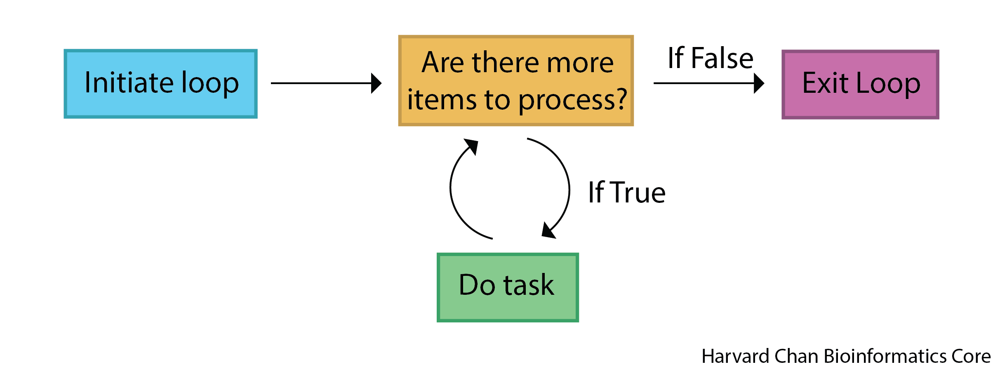
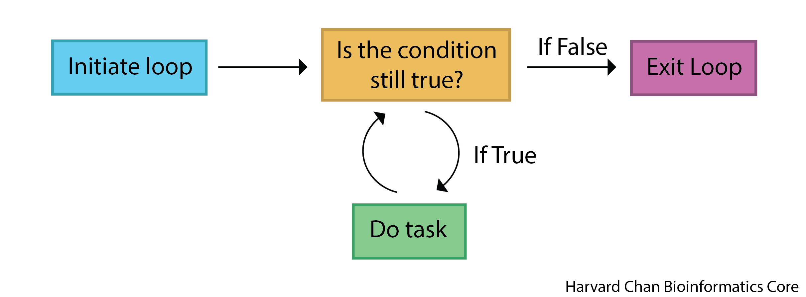

```{python}
#| label: load_data
#| echo: false
# Load libraries and data
species = ["ecoli", "human", "corn", "yeast"]
```

Approximate time: 50 minutes

## Learning objectives 

In this lesson, we will:

- Create `for` loops to iterate over sequences of values
- Implement `for` loops within lists for list comprehension
- Differentiate between `for` and `while` loops

## Overview of lesson

One of the most common problems that programming solves is the tedium of performing the same task/calculation repeatedly. Instead of writing the same code over and over again, we can use loops for autmoation. This is essential in a real analysis, where you might need to process hundreds of files or thousands of values consistently and without human error. 

In this lesson, we will learn about two types of loops: 

- `for` loops 
- `while` loops.

## `for` loops

If we wanted to print out the names of all the species in our `species` list, we would be able to do so with the following code:

```{python}
#| label: for_loop_alternative
#| eval: false
# Print each element within species
print(species[0])
print(species[1])
print(species[2])
print(species[3])
``` 

However, this is not very efficient! Especially if we had a long list of species or were unsure how many elements were in the list. We can instead use a `for` loop to accomplish the same task in a less repetitive manner by iterating over a collection.

To use a `for` loop, we need to specify an interval to loop over and a variable that will take the value of each element. We will then iterate through the sequence, assigning the variable to each element in the sequence in turn and then execute the code block for each element within the loop. 

::: {#fig-for_loop .figure}
{width=600px}

Schematic of `for` loop process.
:::

The general syntax of a `for` loop in Python is as follows:

```{python}
#| label: for_loop_syntax
#| eval: false
# Example for loop syntax
# DO NOT RUN
for variable in sequence:
    # code to be executed
```


### Creating a `for` Loop 

So if we wanted to print out the names of all the species in a list, we could use the following code:

```{python}
#| label: for_loop_example
# Iterate through species, assigning a new element to organism each time through
for organism in species:
    # Print the value of organism
    print(organism)
```

We now created a value `organism` for the for loop. This is a variable that takes the value of each element in the `species` list as we iterate through it. So, in the first iteration of the loop, `organism` will be equal to `"human"`, in the second iteration, `organism` will be equal to `"mouse"`, and so on.

We do not have to assign the list to a variable before we use them. For example, we could iterate over a list of numbers without doing any assignment first and run calculations on those numbers as follows:

```{python}
#| label: for_loop_example_2
# Iterate through a list of integers, assigning a new element to number each time through
for number in [2, 3, 5]:
    # Print "number" followed by the number
    print("number", number)
    # Print "squared" followed by the square of the number
    print("squared", number ** 2)
```

### Indentation matters

Like with `if` statements, the code within the `for` loop must be indented to be executed correctly. If we forget to indent the code, we will get an error. For example, the following `print()` statement will throw an error because it is not indented properly.

```{python}
#| label: indentation_example
#| error: true
# Iterate through species, assigning a new element to organism each time through
for organism in species:
# Print out organism
# Error because line after for loop is not indented
print(organism)
```

This is to once again emphasize that indentation is not just a matter of style in Python, but it is a fundamental part of the syntax. The indented code block is what gets executed as part of the loop, and if we forget to indent, Python does not know what to do.

:::{.callout-tip}
# [**Exercise 1**](05_loops-Answer_key.qmd#exercise-1)
1. Create a `for` loop that goes through a list that contains `True`, `4` and `pretzel`. For each element in that list have it print out the element followed by the datatype of the element.
:::

### Conditional statements within `for` loops

We can use what we learned  about `if` statements in the lesson on [conditional statements](03_conditional_statements.qmd) within our `for` loops to perform different actions based on certain conditions. This can be useful if we want to perform a specific action for certain elements in our list. For example, if we wanted to print out a different message for humans compared to the other species, we could use the following code:

```{python}
#| label: for_loop_with_if
# Iterate through species, assigning a new element to organism each time through
for organism in species:
    # Check if organism is "human"
    if organism == "human":
        # If true, print out this message
        print("This is a human.")
    # Otherwise, do this
    else:
        # Print this message
        print("This is not a human.")
```

### The `range()` function

A common use of `for` loops is to iterate over a sequence of numbers. We can use the `range()` function to generate a sequence of numbers that we can iterate over. The `range()` function takes three arguments:

 - `start` = number that the sequence will start from
 - `stop` = number that the sequence will stop at _(but not include)_ 
 - `step` = number that the sequence will increment by. If you do not provide the `step` argument, the default is 1

For example, if we wanted to iterate over the indices of `species`, we could use the `range()` function as follows:

```{python}
#| label: range_example
# Iterate from 0 up to (not including) the length of species, assigning a new element to i each time through
for i in range(0, len(species)):
    # Print out i
    print(i)
```

### Complex `for` loop example

To show how `for` loops can be used for more complex tasks, let us first create a list of `numbers`. Then using a `for` loop, double the value of each number and keep a running total of those doubled values.

```{python}
#| label: for_loop_doubling_example
# Assign a list of integers to numbers
numbers = [2, 5, 8, 10]

# Initiate total to hold the running total
total = 0

# Iterate through numbers, assigning a new element to number each time through
for number in numbers:
    # Set doubled to equal twice the value of number
    doubled = number * 2
    # Add the doubled value to the previous total
    total = total + doubled

# Print off a message with the value of total
print("Total of doubled numbers:", total)
```

We can follow along with the logic through each iteration of the for loop to see how each of the variables are being updated at each step.

Table: Table of updated values of `number`, `doubled`, and `total` at each iteration of the loop. {#tbl-for_loop_example}

| Index | `number` | `doubled` | `total` |
|-------|--------|---------|---------------|
| 0     | 2      | 4       | 4             |
| 1     | 5      | 10      | 14            |
| 2     | 8      | 16      | 30            |
| 3     | 10     | 20      | 50            |

### List comprehension

There is another "pythonic" way to work with loops and lists called **list comprehension**. In one step it allows you to update or create a new list by iterating over values. Perhaps we would like to subset our list or do something when an element that meets a certain condition in our list. 

The syntax for list comprehension looks like:

```{python}
#| label: list_comprehension_example
#| eval: false
# Example syntax for list comprehension
# DO NOT RUN
[ element_transformation for element in list]
```

Where:

- `element_transformation` is what you want to happen to the element
- `for` is initiating a `for` loop
- `element` is what each element in the `list` will be called
- `in list` is finishing out the `for` loop logic for the list that the `for` loop will iterate through

Let's see an example of this if our goal was to square the numbers in a list:

```{python}
#| label: square_list_comprehension
# Square all elements in a list
[x * x for x in [1, 2, 3, 4, 5]]
```

In this case, I am looping through the list `[1, 2, 3, 4, 5]`, assigning each element to `x` and then carrying out the `element_transformation` part of multiplying `x * x`.

Alternatively, we could interrogate if some element of our list meets a conditional and print it out:

```{python}
#| label: filter_list_comprehension
# Subset a list based on a conditional statement
[x for x in [1, 2, 3, 4, 5] if x == 2 or x == 4]
```

In this case we are looping through our list, `[1, 2, 3, 4, 5]`, assigning each element to `x`. Then asking, is `x` equal to 2 or to 4. If that conditional returns as `True`, then we proceed to our `element_transformation` part and add `x` to an outputted list.

:::{.callout-tip}
# [**Exercise 2**](05_loops-Answer_key.qmd#exercise-2)
1. Use list comprehension to sort through a list `["DNA", "RNA", "Protein"]` and only retain the elements "DNA" or "RNA".
:::

## `while` loops

Like `for` loops, `while` loops will execute a block of code many times over. This execution will continue so long as a certain condition evalutes to true. The `while` loop will stop executing once the condition becomes false.

::: {#fig-while_loop .figure}
{width=600px}

Schematic of `while` loop process.
:::

The general syntax of a `while` loop in Python is as follows:

```{python}
#| label: while_loop_syntax
#| eval: false
# Example syntax for a while loop
# DO NOT RUN
while condition:
    # Code to execute
    ...
    # Update condition
    condition = update(condition)
```

The important distinction between `while` loops and `for` loops is that we must update our condition within the `while` loop in order to keep iterating properly through our loop. We do not have a built in tangible end to the `while` -- unlike the `for` loop, where we stop iterating once we make it to the end of the `sequence` supplied in the statement.


### Creating a `while` loop

`while` loops are typically used when we want to repeat a block of code an unknown number of times or when we want to repeat a block of code until a certain condition is met. For example, if we wanted to keep doubling a number until it is greater than 100, we could use a `while` loop as follows:

```{python}
#| label: while_loop_example
# This will hold the current value of the number and we will initialize it with 1
number = 1

# While number is less than or equal to 100
while number <= 100:
    # Print number
    print(number)
    # Update the number by doubling it and reassigning it to number
    number = number * 2

# Print the last number which triggered the while loop to exit
print("Last number:", number)
```

Why is our last number 128 and not 64? 

This is because the condition `number <= 100` is still true when `number` is equal to 64, so we execute the code block one more time, which doubles `number` to 128. After that, the condition `number <= 100` is no longer true, so we exit the loop and print the last number.

### Infinite loops

A very important thing to note about `while` loops is they can potentially run indefinitely if the condition never becomes false. Therefore, it is important to make sure that the condition will eventually become false, otherwise we will have an infinite loop. For example, the following code will run indefinitely because the condition `i < 5` will always be `True`:

```{python}
#| label: infinite_loop_example
#| eval: false
# Initialize a value for i as 0
i = 0

# While i is less than 5
# DO NOT RUN
# Note this will create an infinite loop, because the condition is never met
while i < 5:
    # Print i 
    print(i)
```

**Be sure to hit square stop button to stop the loop if you accidentally run an infinite loop!**

:::{.callout-tip}
# [**Exercise 3**](05_loops-Answer_key.qmd#exercise-3)
1. The [Collatz conjecture](https://en.wikipedia.org/wiki/Collatz_conjecture) is a big open question in mathematics. It states that any positive integer will form a sequence that ends with 1, if:

- On even numbers you halve the value
- On odd numbers you triple the value and add 1. 

Let's create a `while` loop to evaluates the number 17 to see each step in the path that it takes on its way to 1. With each iteration, we want to:

- Print the current integer being tested
- If it is an even integer, divide it in half
- If it is in an odd integer, multiply it by 3 and add 1
- Exit the `while` loop when it reaches 1

_Hint: You will likely want to use a modulo operator, `%`. Modulo operators tell you the remainder following division. For example:_ 

 - 4 mod 2 = 0 because the remainder of 4 divided by 2 is 0
 - 5 mod 2 = 1 because the remainder of 5 divided by 2 is 1

:::

***

[Next Lesson >>](06_functions.qmd)

[Back to Schedule](../schedule/schedule.qmd)
