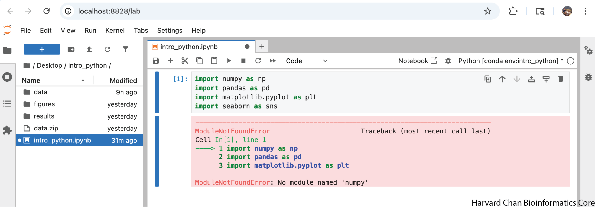

# Exercise 1

1. Repeat the steps above to install the following packages from the Anaconda Navigator:
    - `jupyter`
    - `pandas`
    - `matplotlib` 
    - `scikit-learn`
    - `seaborn`
    - `nb_conda_kernels`

This installation may take quite some time as there are many dependencies that will need to be installed for each of these packages. 

You will know that the installation is complete if you search installed packages and see each of these libraries with a green checkmark next to them.

::: {#fig-install_jupyter .fig}
{width=800px}

Installation of `jupyter`.
:::

::: {#fig-install_pandas .fig}
{width=800px}

Installation of `pandas`.
:::

::: {#fig-install_matplotlib .fig}
{width=800px}

Installation of `matplotlib`.
:::

::: {#fig-install_scikit_learn .fig}
{width=800px}

Installation of `scikit-learn`.
:::

::: {#fig-install_seaborn .fig}
{width=800px}

Installation of `seaborn`.
:::

::: {#fig-install_nb_conda_kernels .fig}
{width=800px}

Installation of `nb_conda_kernels`.
:::

# Exercise 2

1. To ensure that you have successfully installed some of the libraries from the previous exercise, try running the import commands:

```{python}
#| label: import_libraries
#| eval: false
import numpy as np
import pandas as pd
import matplotlib.pyplot as plt
import seaborn as sns
```

This should look like:

::: {#fig-load_packages .fig}
{width=800px}

Loading some of the installed packages. There should be no error message.
:::

If you get an error loading a package it will look like:

::: {#fig-load_packages_error .fig}
{width=800px}

How the error message will look if a package failed to load.
:::
