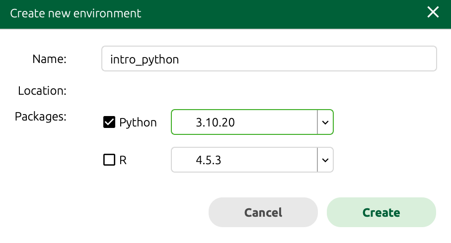
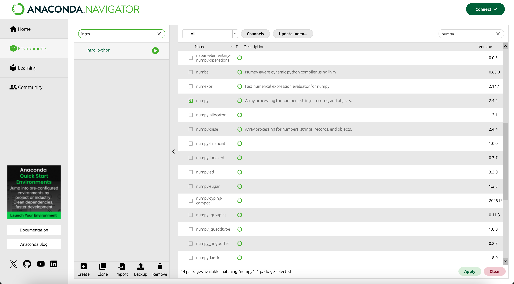
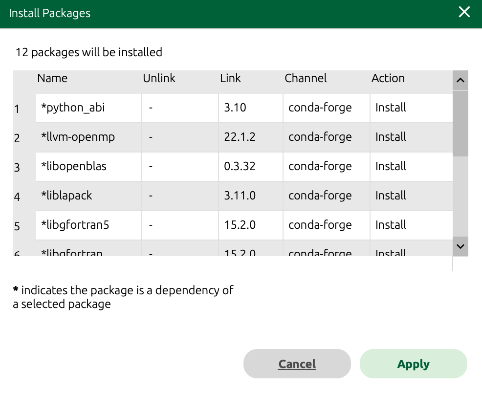

Approximate time: 45 minutes

## Learning objectives 

In this lesson, we will:

- Explain different ways to install external Python libraries
- Demonstrate how to load a library and how to find functions specific to a library

## Overview of lesson

Much of the power and appeal of Python comes from its **rich ecosystem of libraries**. Instead of writing everything from scratch, you can install and import packages that handle tasks like reading CSV files, working with biological sequences, or creating plots. The open-source community has developed a vast array of libraries to support various domains and use cases. You do not have to reinvent the wheel every time you need to perform a common task. 

In this lesson, you will learn how to install, load and explore libraries so you can tap into this broader ecosystem for your own work.

## Libraries in Python

**Libraries** are collections of Python functions, data and compiled code in a well-defined format, created to add specific functionality. Just as we created our own functions in the previous lesson, other users have created packages of functions they have shared with the community in the form of libraries. These packages can be installed and loaded into your Python environment so you can use the functions that they contain.

There are a set of **standard (or base)** packages which are considered part of the Python source code and automatically available as part of your Python installation. Base packages contain the **basic functions** that allow Python to work and enable standard statistical and graphical functions on datasets. For example, all of the functions that we have been using so far in our examples are basic functions.

Libraries are directories where packages for Python are stored. Note that the terms _package and library_ are sometimes used interchangably and there has been some discussion amongst the community to resolve this. 

### Channels for Python libraries

There are many different channels for Python libraries. You can think of these as different places where Python libraries are stored and can be accessed from. Some of the most commonly used channels include:

Table: Common channels for Python libraries. {#tbl-python_channels}

| channel          | description                                                                                   |
|------------------|-----------------------------------------------------------------------------------------------|
| **bioconda**     | Conda channel for bioinformatics tools and libraries.<br>`scanpy`, `anndata`, etc.           |
| **conda-forge**  | Community conda channel with many packages for science, data and general Python use.<br>`NumPy`, `pandas`, etc. |
| **PyPI**         | Main online index for Python packages, used with `pip` to install and manage libraries.<br>`scipy`, `matplotlib`, etc. |

::: callout-note
# Installation channels
If you click on the "Channels" button from the "Environments" tab of the Anaconda Navigator, you can see the channels that are currently being used to search for packages. You can add additional channels here to search for packages that are not available in the default channels. For example, if you want to search for bioinformatics tools, you can add the `bioconda` channel.

Additionally, you can click on the "Not installed" filter to see a list of packages that are not currently installed in your environment. This can be a useful way to find new packages to explore and install.
:::

## Package installation from the Anaconda Navigator

Now that we have an understanding of what libraries are, we can talk about how to install them. There are many different ways to install packages in Python, but two of the more common ways are: 

- Installing from the Anaconda Navigator
- Installing from the [command line](https://docs.conda.io/projects/conda/en/stable/user-guide/getting-started.html) using `pip` or `conda`.

For this workshop, we will use the Anaconda Navigator to install packages. 

### Create a new environment

Generally, the recommendation is to avoid installing backages on `base (root)`. So we are going to **create a new environment**. These are like separate "workspaces" where you can install packages on one environment without affecting the other environments. This can be useful for keeping your projects organized and be consistent with package or Python versions across projects.

To begin, let's first create a new environment called `intro_python`. Navigate to the "Environments" tab in the Anaconda Navigator and click on the "Create" button. In the pop-up window, enter `intro_python` as the name of the environment and select Python 3.10.20 as the version. Then click on the "Create" button to create the environment.

::: {#fig-create_env .fig}
{width="50%"}

Pop-up window for creating a new environment in Anaconda Navigator, where the name of the environment is set to `intro_python` and the Python version is set to 3.10.20.
:::

This step may take a few moments to install everything for your new environment. Once it is done, you should see `intro_python` listed in the "Environments" tab.

### Installing `NumPy`

Within our `intro_python` environment, we are going to install the very popular `NumPy` library (commonly used for matrix and mathematical operations). 

First, change the dropdown menu to either "All" or "Not installed" instead of "Installed". Next, in the search bar, type `numpy` and press enter. _There many be several packages that appear as all potential search matches are listed in alphabetical order. You may have to scroll until you see the `numpy` package._

Click on the checkbox next to `numpy` to select it for installation, and then click on the "Apply" button to start the installation process. The Anaconda Navigator will handle the installation and will let you know when it is complete.

::: {#fig-install_NumPy .fig}


Anaconda Navigator window for installing the `numpy` package in the `intro_python` environment.
:::

You may get another pop-up window asking you to confirm the installation of `NumPy` and any dependencies that it may have. Dependencies are other libraries that `NumPy` uses under the hood in order to function properly. Therefore, we want to install these additional packages to have a succesful installation of `NumPy`. Click on the "Apply" button to confirm the installation and continue with the process.

::: {#fig-confirm_install_NumPy .fig}
{width="50%"}

Pop-up window for confirming the installation of the `NumPy` package and dependencies in the `intro_python` environment.
:::


We only need to install a package once on our computer. However, in order to use the package, we need to load the library every time we start a new Python session. You can think of this as **installing a bulb** versus **turning on the light**.

So now we will never have to install `NumPy` again for whenever we are using the `intro_python` environment.


:::{.callout-tip}
# **Exercise 1**
1. Repeat the steps above to install the following packages from the Anaconda Navigator:
    - `jupyter`
    - `pandas`
    - `matplotlib` 
    - `scikit-learn`
    - `seaborn`
    - `nb_conda_kernels`

This installation may take quite some time as there are many dependencies that will need to be installed for each of these packages. 

You will know that the installation is complete if you search installed packages and see each of these libraries with a green checkmark next to them.
:::

## Importing libraries

Now that we have installed the libraries we want to use, we need to import them into our Python environment in order to access their functions. 

### Changing the kernel in Jupyter Lab

First, we will close our Jupyter Lab notebook and re-launch it to make sure that we are using the `intro_python` environment by setting our "kernel" to `intro_python`. Kernels are another way to refer to a Python environment in Jupyter Lab. When we relaunch Jupyter Lab it should ask us which kernel we would like to use. Select `Python [conda env:intro_python]*` and click "Select". We should now see that out kernel is `Python [conda env:intro_python]*` in the top right of our Jupyter notebook.

::: {#fig-change_kernel .fig}
{width=600px}

Selecting our `intro_python` kernel.
:::

::: {.callout-note collapse="true"}
# Alternative way to change kernel
To check that we are using the correct kernel, we can look at the top right corner of our Jupyter Lab notebook. It should say `Python [conda env:intro_python]*` or something similar. If it does not, you can click on the kernel name and select `Python [conda env:intro_python]*` from the dropdown menu to switch to the correct environment.
:::

### Importing `NumPy`

Now that we are in the correct environment, we can import the libraries that we want to use. To do so, we use the `import` statement followed by the name of the library. For example, to import the `NumPy` library, we would use the following code:

```{python}
#| label: import_NumPy
# Import the NumPy library
import numpy
```

We will know that the library has been imported successfully if we do not get any error messages when we run this code. Once we have imported the library, we can use the functions that the library contains by prefixing the function name with the library name and a dot. For example, to use the `array()` function from the `NumPy` library, we would use the following code:

```{python}
#| label: NumPy_array
# Use the array function from NumPy to create an array from a list called my_array
my_array = numpy.array([1, 2, 3, 4, 5])

# Print my_array
print(my_array)
```

### Library aliases

It is common practice to import libraries with an alias, which is a shorter name that we can use to refer to the library. This can make our code more concise and easier to read. We can import a library with an alias, by using the `as` keyword followed by the alias we want to use. For example, it is common to import the `NumPy` library with the alias `np`. We can do the same with the following code:

```{python}
#| label: import_NumPy_alias
# Import NumPy with the alias np
import numpy as np
``` 

Now we can try creating `my_array` again with alias instead of the full library name:

```{python}
#| label: NumPy_array_alias
# Use the array function from NumPy, with alias np, to create an array from a list called my_array
my_array = np.array([1, 2, 3, 4, 5])

# Print my_array
print(my_array)
``` 

It does not really matter what you set this alias to be as long as it does not conflict with existing names. For example, you could  `import numpy as meow_math` and it would work just fine.

```{python}
#| label: NumPy_array_meow_math
# Import NumPy using the alias, meow_math
import numpy as meow_math

# Create a NumPy array with the meow_math alias 
my_array = meow_math.array([1, 2, 3, 4, 5])

# Print my NumPy array
print(my_array)
```

However, it is good practice to use the commonly accepted aliases for libraries. For example, `NumPy` is commonly imported as `np`, `pandas` is commonly imported as `pd`, and `matplotlib.pyplot` is commonly imported as `plt`. Using these common aliases can make your code more readable and easier for others to understand.

:::{.callout-tip}
# **Exercise 2**
1. To ensure that you have successfully installed the libraries from the previous exercise, try running the import commands:

```{python}
#| label: import_libraries
#| eval: false
import numpy as np
import pandas as pd
import matplotlib.pyplot as plt
import seaborn as sns
```

:::

### Import a submodule

Some libraries are large and have many functions that are organized into submodules. For example, the `scikit-learn` library has many functions that are organized into submodules such as `sklearn.ensemble` and `sklearn.cluster`. If we want to use a function from a specific submodule, we can import that function directly from the library. For example, if we want to use the `RandomForestClassifier` function from the `sklearn.ensemble` submodule, we can import it with the following code:

```{python}
#| label: import_random_forest
# Import the RandomForestClassifier function from the sklearn.ensemble submodule
from sklearn.ensemble import RandomForestClassifier
```

This way we do not have to import the entire `sklearn` library and can just import the specific functions that we need.


***

[Next Lesson >>](08_numpy_arrays.qmd)

[Back to Schedule](../schedule/schedule.qmd)
