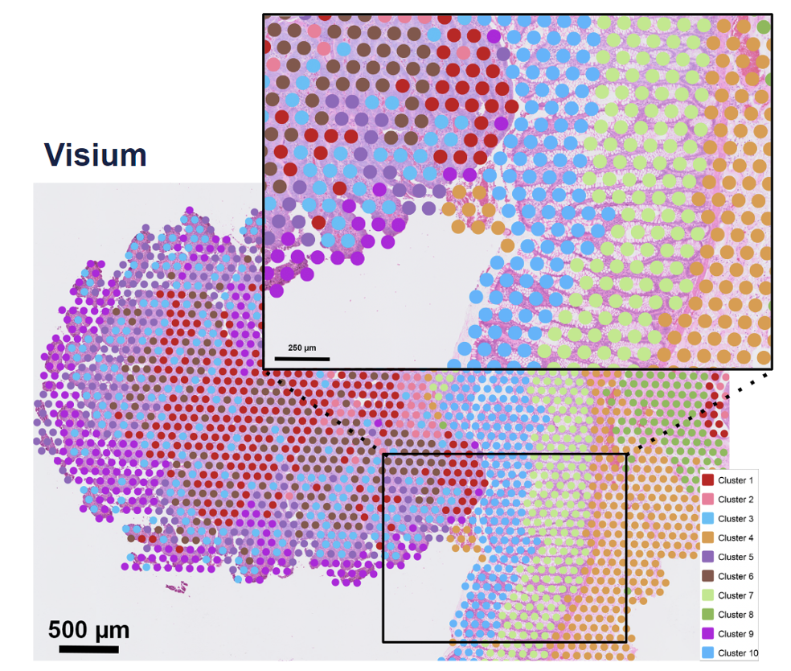
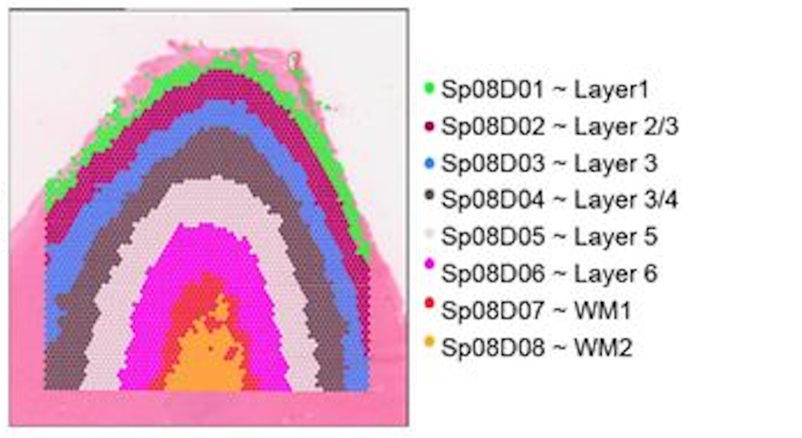
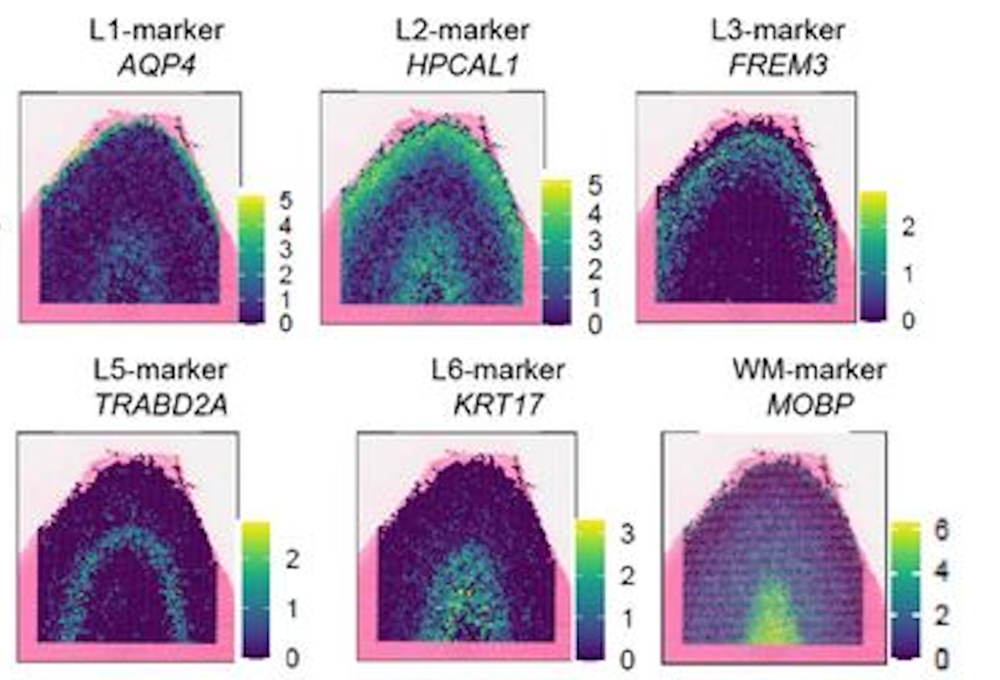
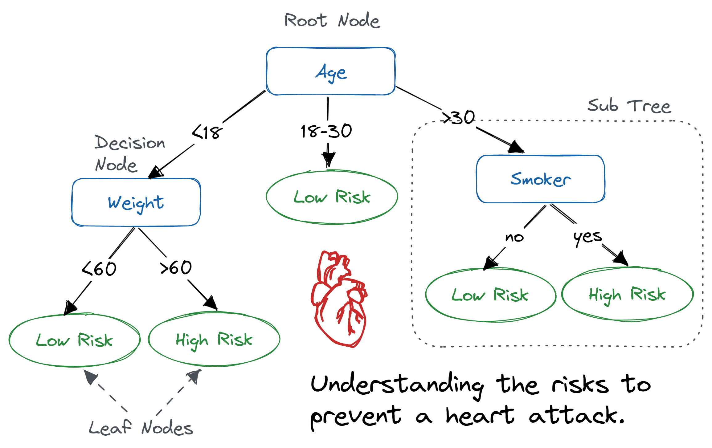
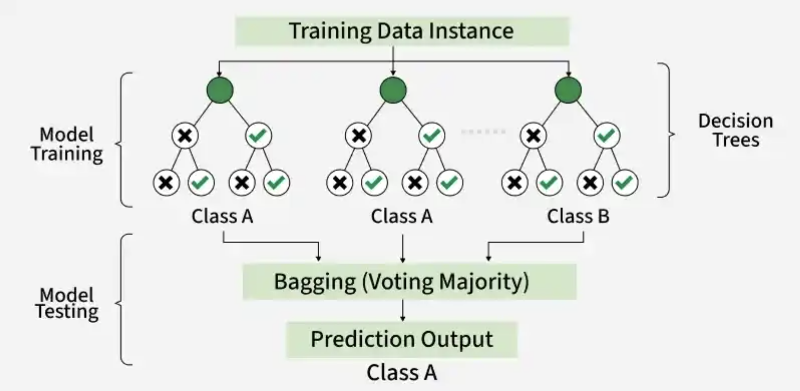

Approximate time: XX minutes

## Learning Objectives 

In this lesson, we will:

- Load a spatial transcriptomics dataset of the human cortex
- Train a random forest classifier to predict cortical layer labels based on spatial location and gene expression
- Evaluate the performance of the random forest classifier

## Overview of lesson

When doing XYZ...

## Machine learning

Machine learning is a subfield of artificial intelligence that focuses on training models to learn patterns from data and make predictions without a human explicitly programming the rules. There are many different types of machine learning algorithms, but they all share the same general steps of:

1. Preparing the training and test datasets
2. Training the model on the training data
3. Evaluating the model's performance on the test data
4. Using the model to make predictions on new data

These algorithms can be used for a wide range of applications, including image recognition, natural language processing, and predictive modeling.

## Cortical layer dataset

To provide a real-world example of how to use machine learning in research, we will be using a synthetic [Visium HD](https://www.10xgenomics.com/platforms/visium/product-family) spatial transcriptomics dataset. In this experiment, you take a piece of tissue and lay it on a grid. Then, each spot is genomically sequenced such that you know **both the spatial location and gene expression** of each spot. 

::: {#fig-visium_hd .figure}
{width=300}

Example of a Visium spatial transcriptomics dataset, where each spot has two key pieces of information: spatial location and gene expression. <br>
_Image source: [10x Genomics](https://www.10xgenomics.com/blog/your-introduction-to-visium-hd-spatial-biology-in-high-definition)_
::: 

::: columns

::: column
The human cortex is a great use case for this technology because the brain is divvied into layers 1-6 and a white matter layer. A good analogy would be to think of them as an onion, where the layers are stacked right on top of each other spatially (x, y coordinates). 

The layers are relatively distinct in their spatial locations but also have genes that are expressed highly in one layer and not the others. This makes it a great use case for machine learning because we can use both the spatial location and gene expression to predict which layer a cell belongs to.
:::

::: column
::: {#fig-cortical_layers_paper .figure}
{height=50}

Spatial locations of the cortical layers in the human brain. <br>
_Image source: [Rai et al. (2026)](https://www.biorxiv.org/content/10.64898/2026.01.12.698703v1.full)_
:::
:::

:::

**We will be using a synthetic cortical dataset with labelled cortical layers to train a random forest classifier to predict which layer a cell belongs to.**


### Cortical information

We have created a made-up dataset (as the data has not been published yet) based upon [this dataset](https://www.biorxiv.org/content/10.64898/2026.01.12.698703v1.full). Where layers are broken into 6 cortical layers (L1, L2, L3, L4, L5, L6) and a white matter layer. The dataset contains spatial coordinates of cells in the cortex, as well as the cortical layer that each cell belongs to.

```{python}
#| label: tbl-load_cortical_data
#| tbl-cap: Cortical cells data, where the x and y coordinates represent the spatial locations of each cell as well as the cortical layer they belong to.
# Load libraries
import pandas as pd
import seaborn as sns
import matplotlib.pyplot as plt

from sklearn.ensemble import RandomForestClassifier
from sklearn.model_selection import train_test_split
from sklearn.metrics import accuracy_score, confusion_matrix

# Load synthetic cortical dataset
df_cortical = pd.read_csv("data/synthetic_cortex_data.csv")
df_cortical.head()
```

We have the following columns in this dataset:

- `barcode`: A unique identifier for each spot in the dataset
- `x`: The x coordinate of the cell's spatial location
- `y`: The y coordinate of the cell's spatial location
- `layer`: The cortical layer that the cell belongs to (L1, L2, L3, L4, L5, L6, WM)

As this is a spatial dataset, we can visualize where on the tissue each cell is located by plotting the x and y coordinates of each cell and coloring the points by the cortical layer that they belong to:

```{python}
#| label: fig-cortical_layers
#| fig-cap: "Spatial plot of the cortical cells colored by the cortical layer they belong to."
# Plot the spatial locations of the cells colored by the cortical layer they belong to
sns.scatterplot(data=df_cortical, 
                x="x", y="y", 
                hue="cortical_layer", 
                edgecolor=None,
                palette="tab10")

# Add title and axis labels
plt.title("Brain Cells by Cortical Layer")
plt.xlabel("x coordinate")
plt.ylabel("y coordinate")
plt.legend(title="Cortical Layer")
plt.show()
```

So now we have a better idea of what the cross-section of the cortex looks like and where the different layers are located.

However, just using the x and y coordinates of each spot is not enough. You may have noticed that there apepars to be some mixing of layers near the boundaries. Luckily for us, the different cortical layers have known genes that are highly expressed in distinct layers. We can take a quick look at some canonical markers that are used to identify the different cortical layers:

::: {#fig-cortical_marker_genes .figure}
{width=550}

Example of the spatial expression of known marker genes for each cortical layer. <br>
_Image source: [Rai et al. (2026)](https://www.biorxiv.org/content/10.64898/2026.01.12.698703v1.full)_
:::

In the dataset, you have have noted that we also have columns: `AQP4`, `HPCAL1`, `FREM3`, `TRABD2A`, `KRT17`, and `MOBP`. These are the log-normalized expression values for those genes in each cell. Similar to the figure from above, we can visualize the expression of these marker genes in each cell (point) across the cortex to see the pattern of values across the different layers. This will give us a better idea of how we can use both the spatial location and gene expression to predict which layer a cell belongs to.

```{python}
#| label: fig-cortical_marker_genes
#| fig-cap: Spatial plot of the gene expression of known marker genes for each cortical layer.
# List of marker genes to plot
genes = ["AQP4", "HPCAL1", "FREM3", 
         "TRABD2A", "KRT17", "MOBP"]

# Initialize a plot with rows and columns for each gene
fig, axes = plt.subplots(2, 3, figsize=(15, 8))

# Make axes a flat list so we can index easily
axes = axes.flatten()

for i, gene in enumerate(genes):
    ax = axes[i]
    sns.scatterplot(
        data=df_cortical,
        x="x", y="y",
        hue=gene,
        palette="viridis",
        edgecolor=None,
        ax=ax
    )
    ax.set_title(f"Expression of {gene} across the cortex")

plt.tight_layout()
plt.show()
```

::: {.callout-note collapse="true"}
# Making multiple subplots in a loop
In the above code, we first initialized a plot with 2 rows and 3 columns - with the goal of plotting each of the 6 genes in our dataset. This creates an **array of plots** which we can then access to generate each of our plots.

So we could have proceeded using the `[]` indexing we have been using for matrices, but that is more complex as we would need to keep track of both rows and columns in the for loop. Instead, we can use the `flatten()` method to convert this **2D array of plots into a list of plots**, which is easier to index in the for loop.

:::

**We will be using this synthetic dataset to train a random forest classifier to predict the cortical layer labels based on the spatial location and gene expression of each cell.**


## Random forest classifiers

Random forests allow you to predict a categorical variable (cortical layer) based on one or more predictor variables (x and y coordinates). To do so, the algorithm builds multiple decision trees, which are models that make predictions based on a series of binary decisions (`True` or `False`).

::: {#fig-decision_tree_example .figure}
{width="80%"}

Example of a decision tree where the variables are age, weight, and smoker to predict risk level of a heart attack.<br>
_Image source: [DataCamp](https://www.datacamp.com/tutorial/decision-tree-classification-python)_
:::

These decision trees comprise of decision nodes, which are the points where the data is split based on a predictor variable, and leaf nodes, which are the final predictions made by the tree.

Random forests build multiple decision trees and combine their predictions to improve accuracy and reduce overfitting. These trees are built on random subsets of the data. Then, a majority vote is taken across the final decision of all the trees to make the final prediction.

::: {#fig-random_forest_example .figure}
{width="80%"}

Example of a random forest with 3 decision trees to generate a prediction based upon majority voting.<br>
_Image source: [GeeksforGeeks](https://www.geeksforgeeks.org/random-forest-classifier-using-scikit-learn/)_
:::

### Preparing training dataset

The _learning_ of machine learning comes from the fact that these algorithms must first learn patterns. This is accomplished by taking a subset of labelled data, the **training set**, to train the model. From this, the random forest classifier would learn how to predict the cortical layer of a cell based on its x, y coordinates and gene expression.

First we are going to define what is the label we want to predict (`cortical_layer`), and what are the predictor variables we want to use to make that prediction, (`x`, `y` coordinates and gene expression). Oftentimes there will be referred to as the `X` and `y` respectively.

```{python}
#| label: define_feature_target_cols
# Feature and target columns
feature_cols = ["x", "y", "AQP4", "HPCAL1", "FREM3",
                "TRABD2A", "KRT17", "MOBP"]
target_col = "cortical_layer"

# Set X and y for future use in training and prediction
X = df_cortical[feature_cols]
y = df_cortical[target_col]
```

With this information, we can now prepare our training and test dataset with `train_test_split()` from the `sklearn.model_selection` module. This function will split our dataset into a **training set and a test set**. 

We will train the model on the training set and then evaluate its performance (accuracy) on the test set. We supply the following parameters into the function:

- `test_size`: proportion of the dataset that we want to use as the test set (30% of the data for testing and 70% for training).
- `stratify`: distribution of the target variable (`cortical_layer`) is the same in both the training and test sets. This is to reduce bias due to sampling and ensure that the model is trained on a representative sample of the data.
- `random_state`: random seed for reproducibility.

```{python}
#| label: prepare_training_data
X_train, X_test, y_train, y_test = train_test_split(
    X,
    y,
    test_size=0.3,
    random_state=42,
    stratify=y
)
```

::: callout-warning
explain how we assign values to multiple variables at once.
:::


### Train random forest classifier

To create the model, first we are going to initialize an instance of the `RandomForestClassifier` class from the `sklearn.ensemble` module. We will specify the number of trees in the forest using the `n_estimators` parameter and set a random seed, `random_state`, for reproducibility.

```{python}
#| label: initialize_random_forest
# Initialize the random forest classifier
rf = RandomForestClassifier(n_estimators=100,
                            random_state=42,
                            class_weight="balanced")
```

Next, we will train the model using the `fit()` method, which takes in the predictor variables (x and y coordinates) and the target variable (cortical layer) from the training data.

```{python}
#| label: train_model
# Train the random forest classifier model
rf.fit(X_train, y_train)
```


## Predict cortical layer labels

With this model, `rf`, we can now predict the cortical layer labels of the test dataset using the `predict()` method. Once again supplying the x and y coordinates, but this time for the prediction data instead of the training data. The model will use the patterns it learned from the training data to predict which cortical layer each unassigned cell belongs to based on its spatial location.

```{python}
#| label: predict_cortical_layer
# Predict coritcal layers for test dataset
y_pred = rf.predict(X_test)
```

So now we have `y_pred`, but what is this output?

```{python}
#| label: type_y_pred
type(y_pred)
``` 

It is a numpy array! So we can access the first few elements to see what the predicted labels look like:

```{python}
#| label: view_predicted_labels
# View the first few predicted labels
y_pred[0:5]
```


::: {.callout-note collapse="true"}
# Visualizing a _single_ decision tree in the random forest

```{python}
#| label: visualize_decision_tree
#| fig-cap: Visualization of a single decision tree from the random forest model.
#| fig-width: 40
#| fig-height: 15
# Source - https://stackoverflow.com/a/61037626
# Posted by Michael James Kali Galarnyk
# Retrieved 2026-04-09, License - CC BY-SA 4.0
from sklearn import tree

fn = df_cortical["cell_barcode"]
cn = df_cortical["cortical_layer"]

fig, axes = plt.subplots(nrows = 1,
                         ncols = 1,
                         figsize = (70, 25),
                         dpi=300)

tree.plot_tree(rf.estimators_[0],
               feature_names = fn, 
               class_names = cn,
               filled = True)

plt.show()
```

:::

## Assessing model performance

At this point, we have the predicted labels for the test dataset, but how do we know if these predictions are accurate? To evaluate the performance of our model, we can compare the predicted labels to the true labels of the test dataset.

### Accuracy of model predictions

Now that we have the predicted and true labels of the test dataset, we can calculate the accuracy of our model's predictions. Accuracy is calculated as the number of correct predictions divided by the total number of predictions.

```{python}
#| label: calculate_accuracy
# Calculate the accuracy of the model's predictions
acc = accuracy_score(y_test, y_pred)
accuracy_percentage = acc * 100
accuracy_percentage
``` 

Our accuracy is quite high! This tells us that our model is doing a good job at predicting the cortical layer labels based on the x, y coordinates and gene expression. However, accuracy alone does not always give us the full picture of how well our model is performing.

Confusion matrices are another way to evaluate the performance of classification. This table shows the number of labels that were correctly predicted (true positives and true negatives) and the number of labels that were incorrectly predicted (false positives and false negatives).

```{python}
#| label: calculate_confusion_matrix
class_names = sorted(y.unique())
cm = confusion_matrix(y_test, y_pred, labels=class_names)

plt.figure(figsize=(8, 6))
sns.heatmap(
    cm,
    annot=True,
    fmt="g",
    cmap="Blues",
    xticklabels=class_names,
    yticklabels=class_names
)
plt.title("Random Forest – Confusion Matrix (Test Set)")
plt.xlabel("Predicted label")
plt.ylabel("True label")
plt.tight_layout()
plt.show()
```

This can help you understand which classes the model is doing well on and which classes it is struggling with. If your accuracy is low, you can look at the confusion matrix to see which classes are being misclassified and potentially adjust your model or data accordingly.

## Next steps

With this model, you could try to predict the cortical layer labels of other datasets. You could also try to use different predictor variables (e.g. only gene expression or only spatial coordinates) to see how that affects the accuracy of the model's predictions.

***

[Back to Schedule](../schedule/schedule.qmd)